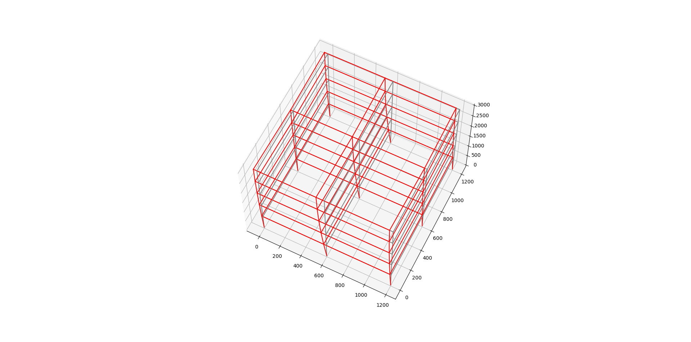

## Multi Degree Of Freedom (MDOF) Simulation 
Create MDOF structural frame models and analyze them using OpenSees for post-disaster earthquake events.



## OpenSees Installation
Install [tcl](http://www.tcl.tk/software/tcltk/) on your machine to use OpenSees (>3.2.2).

The Windows executable files for OpenSees are contained in the `OpenSees` folder in this repo. If you are Linux then consider building OpenSees from source using this [guide](https://www.researchgate.net/post/How-to-install-opensees-in-UBUNTU).

### Inputs
The `Inputs.tcl` file contains the basic input parameters to run the model, including frame type, frame geometry, and ground motion parameters. The ground motion input file is contained in the `GMfiles` folder.

Other parameters can be changed in the model or analysis files inside the `tcl` folder. `Inputs.tcl` only includes the important ones.

### Units
The model by default uses imperial units. However, this can be easily be changed through the `LibUnits.tcl` by defining metric variables for conversions.

### Running the Program

To run the program, run the following commands:
On Windows:
```
run.bat
```

On Linux:
```
./run.sh
```

This will then run the opensees program, produce diplacement outputs for each node, and then plot the frame in 3D.

### Outputs
The outputs produced by the program include `nodes.txt`, `elements.txt`, `disp.out`, and `disp_final.txt`.

1. `nodes.txt`: defines node geometry, `node_id position_x position_y position_z`.
2. `elements.txt`: defines element connectivity, `element_id node_1 node_2`.
3. `disp.out`: defines node displacements at each timestep.
4. `disps_final.txt`: defines the final node displacements (translation + rotations) at the final timestep, which is produced by `process_disps.py`:

```
node_id dx dy dz rotx roty rotz
```

### Visualization

The script `process_disps.py` will also plot a 3d visualization of the displaced post-earthquake structure at scale=100. However, the scale is not constant in the x, y, and z directions.

Example:

